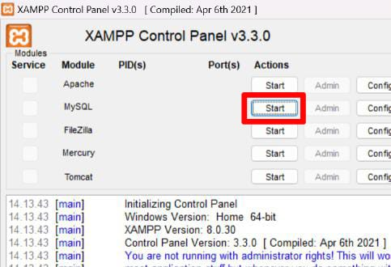
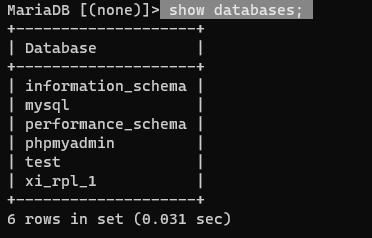

 
# Menggunakan xampp
MySQL merupakan salah satu sistem manajemen basis data SQL (_database management system/DBMS_) yang bersifat _open soruce_ dan ada juga yang berlisensi dalam beberapa kasus saat penggunaannya. Dalam installasi MySQL juga terdapat berbagai macam aplikasi yang disediakan, ada yang berupa _stand alone_ dan berupa _package_ seperti XAMPP atau WAMP pada sistem operasi Windows dan LAMPP pada sistem operasi berbasis Linux.
langkah-langkah mengakses MySQL Command Line melalui Shell XAMPP.

1. Buka XAMPP dan Start service MySQL

2. Langkah pertama sudah pasti membuka XAMPP lalu klik Start pada barisan MySQL. Jika _service_ MySQL sudah aktif akan ditandai warna hijau pada teks MySQL dan muncul Port 3306 (Port _default_ jika belum diubah konfigurasinya).

3. Pilih Shell pada bagian kanan XAMPP
    Pada bagian kanan tampilan XAMPP terdapat beberapa pilihan seperti Config, Netstat, Shell, dll. Nah untuk mengakses MySQL Command Line memalui tampilan XAMPP pilih Shell.

4. Ketikkan perintah mysql -u (username) 
	Untuk mengakses MySQL melalui shell XAMPP diperlukan suatu perintah, untuk perintah masuk ke MySQL tanpa username menggunakan perintah.Sebagai contoh jika menggunakan username root maka perintahnya
    Jika username dalam MySQL menggunakan password, maka menggunakan perintah

	Lalu akan muncul baris baru berupa Enter Password, setelah itu masukkan password dari username tersebut. Dan apabila username tidak memiliki password bisa menggunakan perintah ini akan tetapi pada langkah Enter Password langsung saja tekan Enter.

# Referensi vidio youtube
https://revou.co/panduan-teknis/sql-data-types

# Penggunaan awal MySQL
### Query
```
mysql -u root -p
```

### Hasil 


### Analisis
- `mySQL` merupakan perintah yang dgunakan untuk memulai klien MySQL di baris perintah.
- `-u root` Pengguna an root biasanya memiliki hak akses penuh ke server  MySQL dan dapat melakukan tindakan administratif.
- `-p` Ini adalah opsi yang digunakan untuk meminta kata sandi atau (passwoard) setelah perintah dijalankan.
### Kesimpulan 
perintah ini adalah kita akan masuk ke dalam command-line interface dari MySQL sebagai user `root`, dan kita akan diminta untuk memasukkan password `root` setelah menekan Enter. Jika password yang dimasukkan sesuai, maka kita akan mendapatkan akses ke command-line MySQL dengan hak akses penuh sebagai user `root`.

# Database
Database adalah sekumpulan data yang dikelola berdasarkan ketentuan tertentu yang saling berkaitan sehingga memudahkan dalam pengelolaannya. 
## Buat database
### Query 
 ```
 create database [nama database]
```
### Contoh
```mysql
create database XI_RPL_1;
```
### hasil  

### Analisis
- `CREATE DATABASE`: Ini adalah perintah SQL untuk membuat sebuah database baru.
- `XI_RPL_1`: Ini adalah nama yang diberikan untuk database yang akan dibuat. Dalam hal ini, database tersebut akan dinamakan `XI_RPL_1`.
### Kesimpulan
perintah ini adalah kita telah berhasil membuat sebuah database baru dengan nama `XI_RPL_1` dalam sistem manajemen basis data yang sedang digunakan. Database ini akan kosong saat pertama kali dibuat, dan Anda dapat mulai membuat tabel dan memasukkan data ke dalamnya setelah database berhasil dibuat.

## Tampilkan Database
### Query
```
show database
```
### Hasil

### Analisis Kesimpulan

 *SHOW DATABASE* digunakan untuk menampilkan daftar database yang ada dalam sistem manejemen basis data (DBMS). Perintah ini dapat digunakan di beberapa DBMS seperti MYSQL, PostgreSQL, dan beberapa DBMS lainnya. Namun, perintahnya dapat sedikit berbeda tergantung
## Hapus Database
### Query
```
drop database [nama_dataasbe]
```
### Hasil

### Analisis Database
*<DROP DATABASE [nama_database]>* digunakan dalam sistem manajemen basis data (DBMS) untuk menghapus sebuah database beserta semua objek yang terkait dengan database tersebut, seperti tabel, indeks, tampilan, prosedur tersimpan, dan lain-lain.
## Gunakan Database
### Query
```
use [nama_database]
```
### Hasil

### Analisis Database
*USE [nama_database]* digunakan dalam sistem manajemen basis data (DBMS) untuk beralih atau memilih database yang akan digunakan. Ketika Anda menggunakan perintah `<USE>` diikuti dengan nama database, DBMS akan mengarahkan semua perintah dan operasi selanjutnya pada database yang ditentukan.
# Tipe data
## Angka
- `INT (Integer)1` : Digunakan untuk menyimpan bilangan bulat, seperti 1, 42, -10.
- `DECIMAL atau NUMERIC` : Digunakan untuk menyimpan angka desimal dengan presisi tertentu, seperti 3.14, 123.456.
 
## Teks
- `VARCHAR` : Digunakan untuk menyimpan teks dengan panjang variabel, seperti nama, alamat email.
- `CHAR` : Digunakan untuk menyimpan teks dengan panjang tetap, seperti kode pos.
- `TEXT` : Digunakan untuk teks panjang seperti deskripsi atau catatan.
## Tanggal dan Waktu
- `DATE`: Digunakan untuk menyimpan tanggal, seperti "2023-10-01".
- `TIME`: Digunakan untuk menyimpan waktu, seperti "15:30:00".
- `DATETIME`: Digunakan untuk menyimpan tanggal dan waktu, seperti "2023-10-01 15:30:00".
## Boolean
- `boolean dan bool` :  Digunakan untuk menyimpan nilai benar (true) atau salah (false).
   

### Pilihan
# Tabel 
## Buat tabel
### Struktur Query
```mysql
create table [nama table](
namakolom_1 tipedata(lebar) cons,
namakolom_2 tipedata(lebar) cons,
namakolom_3 tipedata(lebar) cons,
)
```

### Contoh Query
```mysql
create table mobil(
nama_mobil varchar(15) primary key not null,
plat_mobil char(10) not null unique,
warna_mobil varchar(10) not null unique);
```
### Hasil
![[Pasted image 20240206121533.png]]

### Analisis
`nama_mobil varchar(15) primary key not null:`
    `nama_mobil` adalah nama kolom pertama.
    `varchar(15)` menunjukkan bahwa kolom ini memiliki tipe data VARCHAR dengan panjang maksimum 15 karakter.
    `primary key` menandakan bahwa kolom "nama_mobil" digunakan sebagai kunci utama (primary key) untuk tabel ini. Ini berarti nilainya harus unik dan tidak boleh kosong (not null).
    `not null` menunjukkan bahwa kolom "nama_mobil" tidak boleh memiliki nilai null (kosong).1. "plat_mobil char(10) not null unique":
`plat_mobil" adalah nama kolom kedua.
    `char(10)` menunjukkan bahwa kolom ini memiliki tipe data CHAR dengan panjang tetap 10 karakter.
    `not null` menunjukkan bahwa kolom "plat_mobil" tidak boleh memiliki nilai null (kosong).
    `unique` menandakan bahwa nilai dalam kolom "plat_mobil" harus unik, yaitu tidak boleh ada duplikat dalam kolom ini.
`warna_mobil varchar(10) not null unique`
    `warna_mobil` adalah nama kolom ketiga.
    `varchar(10)` menunjukkan bahwa kolom ini memiliki tipe data VARCHAR dengan panjang maksimum 10 karakter.
    `not null` menunjukkan bahwa kolom "warna_mobil" tidak boleh memiliki nilai null (kosong).
    `unique` menandakan bahwa nilai dalam kolom "warna_mobil" harus unik, yaitu tidak boleh ada duplikat dalam kolom ini.
### Kesimpulan 
Kesimpulan dari perintah `CREATE TABLE [nama_tabel]` dalam SQL adalah untuk membuat sebuah tabel baru dalam basis data. harus menyediakan nama tabel yang diinginkan setelah kata kunci `CREATE TABLE`
Kolom "nama_mobil":
    - Nama kolom: "nama_mobil"
    - Tipe data: VARCHAR(15)
    - Primary Key: Ya
    - Not Null: Ya
`Kesimpulan` : Kolom ini menyimpan nama mobil dengan panjang maksimum 15 karakter. Nilai kolom "nama_mobil" harus unik dan tidak boleh kosong (not null). Kolom ini digunakan sebagai kunci utama (primary key) untuk tabel ini.
Kolom "plat_mobil":
    - Nama kolom: "plat_mobil"
    - Tipe data: CHAR(10)
    - Primary Key: Tidak
    - Not Null: Ya
    - Unique: Ya
`Kesimpulan` : Kolom ini menyimpan nomor plat mobil dengan panjang tetap 10 karakter. Nilai kolom "plat_mobil" tidak boleh kosong (not null) dan harus unik. Tidak boleh ada duplikat dalam kolom ini.
Kolom "warna_mobil":
    - Nama kolom: "warna_mobil"
    - Tipe data: VARCHAR(10)
    - Primary Key: Tidak
    - Not Null: Ya
    - Unique: Ya
`Kesimpulan` : Kolom ini menyimpan warna mobil dengan panjang maksimum 10 karakter. Nilai kolom "warna_mobil" tidak boleh kosong (not null) dan harus unik. Tidak boleh ada duplikat dalam kolom ini.
## Tampilkan struktur tabel
### Struktur Query 
```mysql
desc [nama_table];
 ```
### Contoh Query
```mysql
create table mobil;
```
### Hasil

### Analisis
`show tables`: untuk menampilkan semua tabel yang ada dalam database yang sedang aktif.
### Kesimpulan
Perintah `SHOW TABLES` akan menghasilkan output berupa daftar nama-nama tabel yang tersedia dalam database yang sedang digunakan. Output ini memberikan informasi tentang tabel-tabel yang ada dalam database dan memungkinkan pengguna untuk melihat struktur dan konten data dalam tabel-tabel tersebut.
## Menampilkan Tabel
### Struktur Query
```mysql
 describe [nama table]
```
### Contoh Query
```mysql
describe mobil
```
### Hasil

### Analisis
`desc pelanggan`: dapat melihat secara detail karakteristik dari setiap kolom dalam tabel tersebut, termasuk nama kolom, tipe data, panjang maksimum (jika berlaku), dan konstrain khusus seperti PRIMARY KEY, UNIQUE, atau NOT NULL yang diterapkan pada setiap kolom.
### Kesimpulan
perintah tersebut memberikan gambaran tentang bagaimana tabel "Pelanggan" telah didefinisikan dalam basis data.
## Show Table
### Struktur Query 
```mysql
show [namatable];
```
### Contoh Query
```mysql
show tables;
```
### Contoh Query
### Hasil

### Analisis
`SHOW TABLES`:ini akan menghasilkan output berupa daftar semua tabel yang ada dalam database yang sedang digunakan.
### Kesimpulan 
Perintah `SHOW [namatable];` (atau `SHOW TABLES`) digunakan dalam SQL untuk menampilkan daftar tabel yang ada dalam sebuah database. Ketika Anda menjalankan perintah `SHOW [namatable]` di mana [namatable] adalah nama tabel yang ingin Anda lihat, perintah tersebut akan menghasilkan daftar tabel yang sesuai dengan kriteria tersebut dalam database yang aktif.
# QnA
> [! faq]- Menyapa hanya kolom id_pelanggan yang mengggunakan constraint PRIMARY KEY ?
> > Setiap pelanggan memiliki ID yang berbeda, dan tidak ada pelanggan dengan ID yang sama. Dengan menggunakan “ID Pelanggan” sebagai primary key, data pelanggan dapat diidentifikasi secara unik dan tidak ada pelanggan yang memiliki data duplikat dalam tabel.

> [! faq]- Mengapa pada kolom no_telp yang menggunakan tipe data char bukan varchar?
> >Untuk nomor telepon, yang biasanya memiliki panjang tetap, penggunaan `VARCHAR` dapat tergantung pada preferensi dan kebutuhan spesifik aplikasi atau sistem yang Anda kembangkan. Jika nomor telepon Anda cenderung bervariasi dalam panjang, `VARCHAR` mungkin menjadi pilihan yang lebih umum.

> [! faq]- Mengapa hanya kolom telp_yang menggunakan constraint UNIQUE?
> > Dalam konteks kolom telp, constraint UNIQUE berguna ketika Anda ingin memastikan bahwa nomor telepon yang diinput ke dalam basis data tidak boleh ada yang sama. Misalnya, dalam tabel pelanggan, Anda mungkin ingin memastikan bahwa setiap nomor telepon pelanggan adalah unik agar tidak ada pelanggan dengan nomor telepon yang sama.

> [! faq]- Mengapa kolom no_telp tidak memakai constraint NOT NUNLL, sementara kolom lainnya mengggunakan constraint tersebut? 
>> untuk memahami kebutuhan dan kebijakan data dalam konteks aplikasi Anda ketika memutuskan apakah akan menerapkan constraint `NOT NULL` pada kolom nomor telepon atau kolom lainnya. Jika nomor telepon harus selalu diisi dan memiliki nilai yang signifikan, maka menerapkan constraint `NOT NULL` dapat membantu mencegah data yang tidak lengkap atau tidak valid.

> [! faq]- Perbedaan PRIMARY KEY & UNIQUE?
>> PRIMARY KEY digunakan untuk mendefinisikan kunci utama tabel, memiliki keunikan dan tidak boleh NULL.UNIQUE digunakan untuk memastikan keunikan nilai tetapi dapat mengizinkan NULL values dan dapat digunakan lebih dari satu kali dalam satu tabel.

# Insert
## Insert 1 data
### Struktur
```mysql
insert into [nama_tabel]
values (nilai1,nilai2,nilai3,...);
```
### Contoh
```mysql
insert into pelanggan 
values (1,"caca","adel",'0896734634');
```
### Hasil

### Analisis
`INSERT INTO pelanggan`: Menunjukkan bahwa data akan dimasukkan ke dalam tabel "pelanggan".
`VALUES (1, "caca", "adel", '0896734634')`: Menunjukkan nilai-nilai yang akan dimasukkan ke dalam kolom-kolom tabel "pelanggan". Urutan nilai-nilai tersebut harus sesuai dengan urutan kolom dalam tabel.
### Kesimpulan
Perintah `SELECT nama_depan` digunakan untuk memilih atau menampilkan nilai dari kolom `nama_depan` dalam tabel. Dalam hal ini, kita hanya tertarik dengan nilai dari kolom `nama_depan` dan ingin menampilkannya.
Bagian `FROM pelanggan` digunakan untuk menunjukkan sumber data, yaitu tabel `pelanggan`. Perintah ini mengindikasikan bahwa kita ingin mengambil atau mengambil data dari tabel `pelanggan`.
Dengan menggunakan perintah `SELECT nama_depan FROM pelanggan`, kita akan mengambil nilai dari kolom `nama_depan` untuk setiap baris dalam tabel `pelanggan` dan menampilkan nilai-nilai tersebut sebagai hasil. Hasilnya akan berupa daftar nilai `nama_depan` dari semua pelanggan yang ada dalam tabel.
Perintah ini berguna jika kita hanya ingin melihat atau menganalisis nilai dari kolom tertentu dalam tabel. Dalam hal ini, kita hanya tertarik dengan kolom `nama_depan` dan menggunakan perintah ini untuk membatasi hasil hanya pada kolom yang dibutuhkan. Ini bisa sangat berguna jika tabel memiliki banyak kolom atau jika hanya beberapa kolom yang diperlukan untuk analisis atau tampilan data.
## Insert >1 data
### Struktur 
```mysql
insert into nama_tabel
values (nilai1,nilai2,nilai3)
	(nilia1,nilai2,nilai3)
	(nilai1,nilai2,nilai3)
	```
### Contoh
```mysql
insert into nama_tabel
  values (5,'caca','stevani','089512549986'),
	(4,'cici','arendel','086852621793'),
	(3,'cica','vexana','0896437885645');
	```
### Hasil

### Analisis
- `INSERT INTO nama_tabel`: Ini adalah perintah SQL yang digunakan untuk memasukkan data ke dalam sebuah tabel. `nama_tabel` harus diganti dengan nama tabel yang sesuai dalam basis data.
- `VALUES`: Ini adalah bagian yang menunjukkan nilai-nilai yang akan dimasukkan ke dalam tabel. Dalam kasus ini, kita memasukkan beberapa baris data sekaligus.
- `(5,'caca','stevani','089512549986')`: Ini adalah nilai untuk baris pertama yang akan dimasukkan. Angka 5 dimasukkan ke dalam kolom pertama (mungkin kolom ID), 'caca' ke kolom kedua, 'stevani' ke kolom ketiga, dan '089512549986' ke kolom keempat.
- `(4,'cici','arendel','086852621793')`: Ini adalah nilai untuk baris kedua yang akan dimasukkan. Angka 4 dimasukkan ke dalam kolom pertama (mungkin kolom ID), 'cici' ke kolom kedua, 'arendel' ke kolom ketiga, dan '086852621793' ke kolom keempat.
- `(3,'cica','vexana','0896437885645')`: Ini adalah nilai untuk baris ketiga yang akan dimasukkan. Angka 3 dimasukkan ke dalam kolom pertama (mungkin kolom ID), 'cica' ke kolom kedua, 'vexana' ke kolom ketiga, dan '0896437885645' ke kolom keempat.
### Kesimpulan
perintah SQL ini akan memasukkan tiga baris data sekaligus ke dalam tabel yang telah ditentukan. Ini sangat berguna ketika Anda ingin memasukkan beberapa baris data sekaligus daripada melakukan beberapa perintah `INSERT` terpisah. Pastikan untuk menyesuaikan nilai-nilai dengan struktur kolom pada tabel yang dituju, agar tidak terjadi kesalahan saat memasukkan data.

# Select
## Seluruh data
### Struktur
```mysql
select * from [nama_tabel];
```
### Contoh
```mysql
select * from pelanggan;
```
### Hasil

### Analisis
`SELECT *`: Menunjukkan bahwa kita ingin memilih semua kolom dalam tabel.
`FROM pelanggan`: Menunjukkan bahwa kita ingin mengambil data dari tabel `pelanggan`.
### Kesimpulan
`SELECT `: Menunjukkan bahwa kita ingin memilih semua kolom dalam tabel. `FROM` pelanggan: Menunjukkan bahwa kita ingin mengambil data dari tabel 'pelanggan'.
Jadi, perintah `SELECT * FROM pelanggan`, kita akan mengambil dan menampilkan semua data yang ada dalam tabel "pelanggan" beserta semua kolom yang dimiliki oleh tabel tersebut. Hasilnya akan berisi semua baris data dari tabel "pelanggan", dengan setiap kolom yang ditampilkan.
## Data kolom tertentu
### struktur
```mysql
select [nama_kolom1],[nama_kolom2],....,[nama_kolom_n]
from [nama_tabel],
```
### contoh
```mysql
select nama_depan from pelanggan;
```
### Hasil

### Analisis
`SELECT nama_depan`: Menunjukkan bahwa kita ingin memilih atau menampilkan nilai dari kolom `nama_depan` dalam tabel.
`FROM pelanggan`: Menunjukkan bahwa kita ingin mengambil data dari tabel `pelanggan`.
### Kesimpulan
Perintah `SELECT nama_depan` digunakan untuk memilih atau menampilkan nilai dari kolom "nama_depan" dalam tabel. Dalam hal ini, kita hanya tertarik dengan nilai dari kolom "nama_depan" dan ingin menampilkannya.
Bagian `FROM pelanggan` digunakan untuk menunjukkan sumber data, yaitu tabel "pelanggan". Perintah ini mengindikasikan bahwa kita ingin mengambil atau mengambil data dari tabel "pelanggan".
Jadi, kesimpulannya adalah bahwa perintah SQL ini akan mengambil nilai dari kolom "nama_depan" dari setiap baris dalam tabel "pelanggan" dan menampilkannya sebagai hasil. Hasilnya akan berupa daftar nilai "nama_depan" dari semua pelanggan yang ada dalam tabel.
Perintah ini berguna jika kita hanya ingin melihat atau menganalisis nilai dari kolom tertentu dalam tabel. Dalam hal ini, kita hanya tertarik dengan kolom "nama_depan" dan menggunakan perintah ini untuk membatasi hasil hanya pada kolom yang dibutuhkan. Ini bisa sangat berguna jika tabel memiliki banyak kolom atau jika hanya beberapa kolom yang diperlukan untuk analisis atau tampilan data.
## Klausa Where
### struktur
```mysql
select [nama_kolom/] from [nama_tabel]
where [kondisi];
```
### contoh
```mysql
select nama_depan from pelanggan 
where id =2;
```
### Hasil

### Analisis
`SELECT nama_depan`: Menunjukkan bahwa kita ingin memilih atau menampilkan nilai dari kolom `nama_depan` dalam tabel.
`FROM pelanggan`: Menunjukkan bahwa kita ingin mengambil data dari tabel "pelanggan".
`WHERE id = 2`: Menunjukkan bahwa kita ingin memfilter data berdasarkan kondisi di mana nilai kolom `id` harus sama dengan 2.
### Kesimpulan
Hasil dari perintah `SELECT nama_depan FROM pelanggan WHERE id = 2` akan mengembalikan nilai kolom `nama_depan` dari baris yang memenuhi kondisi yang diberikan. Jika ada baris dengan nilai kolom `id` sama dengan 2, maka nilai kolom `nama_depan` dari baris tersebut akan ditampilkan. Jika tidak ada baris yang memenuhi kondisi tersebut, maka hasilnya akan kosong.
Perintah ini berguna jika kita ingin mengambil nilai dari kolom tertentu berdasarkan kondisi yang ditentukan. Dalam kasus ini, kita ingin mengambil nilai `nama_depan` dari pelanggan dengan `id` yang sama dengan 2.

 
# Update
### Struktur 
```mysql
update nama_tabel set nama_kolom where kondisi;
```
### Contoh
```mysql
update pelanggan set no_telp="0988786765"
 where id_pelanggan="5";
```
### Hasil

### Analisis
`UPDATE pelanggan`: Ini adalah bagian perintah yang menunjukkan bahwa data dalam tabel pelanggan akan diperbarui.
`SET no_telp="0988786765"`: Bagian ini menentukan perubahan yang akan dilakukan. Nilai kolom no_telp akan diubah menjadi "0988786765". 
`WHERE id_pelanggan="5"`: Ini adalah klausa yang menentukan baris mana yang akan diperbarui. Kondisi ini menyatakan bahwa hanya baris di mana nilai dalam kolom `id_pelanggan` adalah "5" yang akan diubah. 
	`id_pelanggan`: Nama kolom dalam tabel `pelanggan` yang diacu. 
	`=`: Operator perbandingan yang digunakan untuk memeriksa kesamaan. 
	`"5"`: Nilai yang dibandingkan. Nilai "5" diapit oleh tanda kutip ganda, menunjukkan bahwa nilai tersebut diperlakukan sebagai string.
### Kesimpulan
untuk memperbarui data dalam tabel bernama `pelanggan`. Lebih khususnya, pernyataan ini akan mengubah nilai kolom `no_telp` menjadi "0988786765" untuk baris di mana nilai dalam kolom `id_pelanggan` adalah "5".
# Delete/Hapus data
## delete
### Struktur
```mysql
Delete from nama_tabel where kondisi;
```

### Contoh
```mysql
delete from pelanggan where id_pelanggan=
"1";
```
### Hasil

### Analisis 
`DELETE FROM pelanggan`: Bagian ini menentukan bahwa Anda ingin menghapus data dari tabel bernama "pelanggan".
`WHERE id_pelanggan = "1"`: Bagian ini adalah kondisi yang menentukan baris mana yang harus dihapus. Dinyatakan bahwa hanya baris yang nilai pada kolom "id_pelanggan" sama dengan "1" yang harus dihapus.
    - `id_pelanggan`: Ini adalah nama kolom pada tabel "pelanggan" yang direferensikan.
    - `=`: Ini adalah operator perbandingan yang digunakan untuk memeriksa kesetaraan.
    - `"1"`: Ini adalah nilai yang dibandingkan. Nilai "1" diapit tanda kutip ganda, yang menunjukkan bahwa nilai tersebut diperlakukan sebagai string.
### Kesimpulan
untuk menghapus data dari tabel bernama `pelanggan`. Hanya baris atau entri yang memenuhi kondisi tertentu yang akan dihapus, yaitu baris-baris di mana nilai dalam kolom `id_pelanggan` sama dengan "1".

## hapus data
### struktur
```mysql
drop [nama tabel]
```
### contoh
```mysql
drop table mobil;
```
### hasil

### analisis
`DROP TABLE mobil`: Menghapus tabel bernama `mobil` dari dalam database
### kesimpulan
Perintah `DROP TABLE mobil;` digunakan untuk menghapus tabel `mobil` dari dalam database. Setelah perintah ini dijalankan, semua data yang ada dalam tabel tersebut akan dihapus, dan struktur tabel `mobil` akan dihapus dari database.
